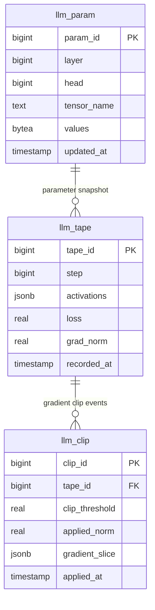

# GPT-2 Inside PostgreSQL: Storage and Training Overview

This guide visualizes how the `pg_llm` extension persists GPT-2 model
parameters, tracks computations, and executes backpropagation entirely inside
PostgreSQL. The accompanying figures are generated on demand by running
`python scripts/generate_visualizations.py` from the project root.

## Entity Relationship Diagram

## Training Metrics

The synthetic chart below mirrors the type of metrics that would be collected
in `llm_tape` during fine-tuning. Loss decreases as epochs progress while the
system monitors gradient norms against the clipping threshold stored in
`llm_clip`.

## Gradient Flow Animation

During backpropagation PostgreSQL iterates between reading parameters,
recording activations, clipping gradients, and writing updates. The animation
highlights which table is active at each stage.

## Putting It Together

1. **Forward pass**: `llm_param` supplies weights needed to evaluate tokens. The
   intermediate activations land in `llm_tape`.
2. **Metrics logging**: After each micro-batch the loss and gradient norms are
   appended to `llm_tape`, creating the history used to chart convergence.
3. **Gradient clipping**: When norms exceed the configured threshold,
   `llm_clip` records the clipped values to keep training stable.
4. **Parameter updates**: The optimizer writes new tensors back into
   `llm_param`, closing the loop.

These assets provide a quick mental model for how GPT-2 training is orchestrated
entirely inside SQL tables.
